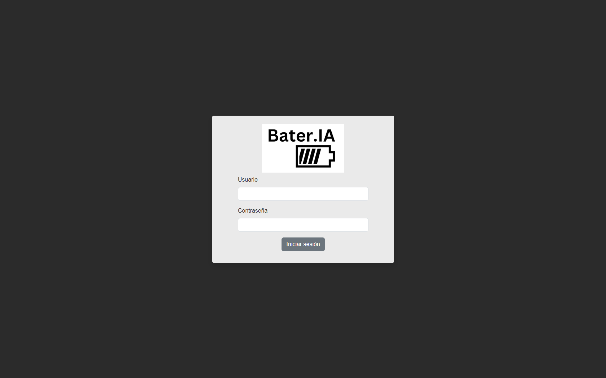
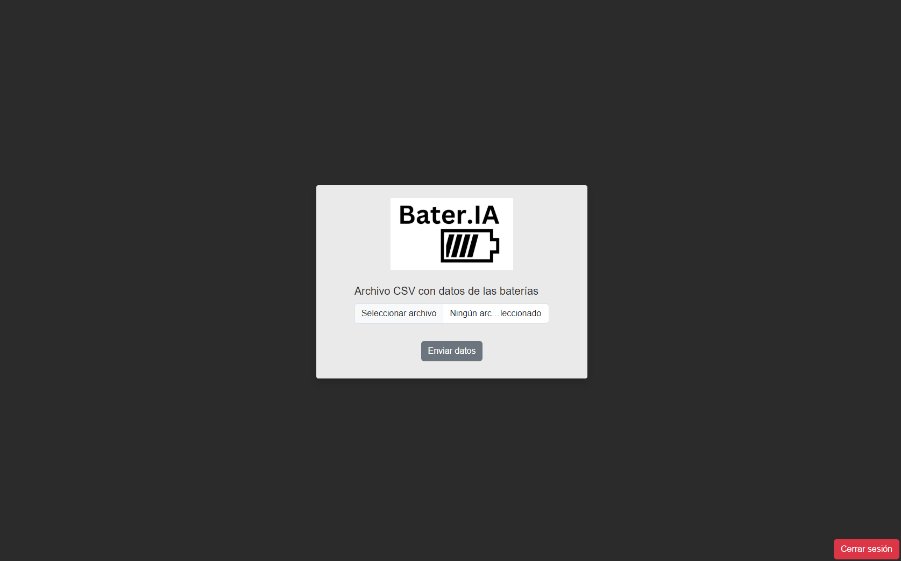
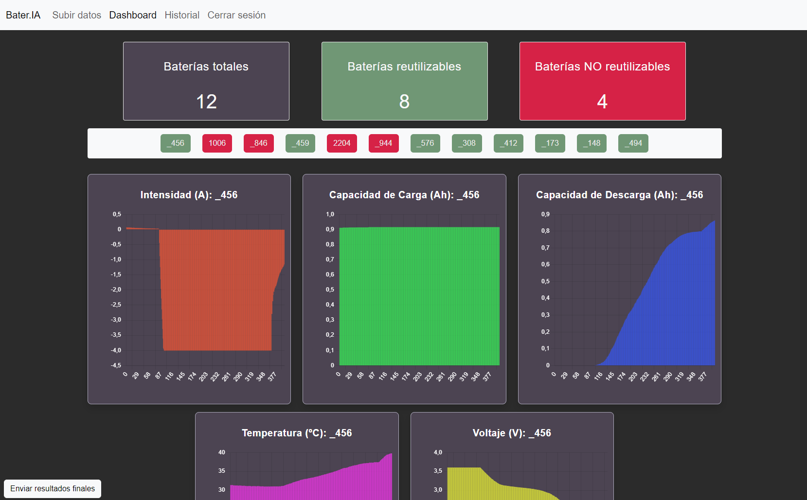
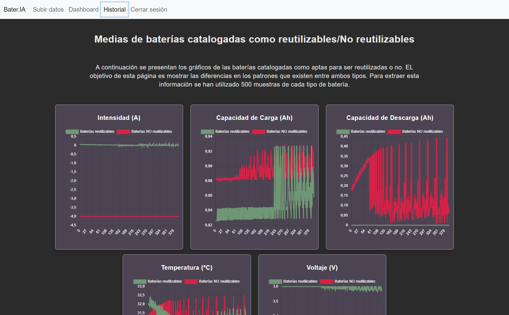

<h1 align="center" id="title">Bater.IA</h1>

<p id="description">Este proyecto ha sido realizado dentro de la asignatura de Proyecto integrado con Inteligencia Artificial (PIA) de la UPC. Este proyecto consiste en una aplicación web desarrollada con Angular y Flask que tiene el objetivo de ofrecer una solución a la clasificación de baterías de litio para poder ser reutilizadas o no.</p>

<h2>🚀 Demo</h2>

<h2>Project Screenshots:</h2>









<h2>🛠️ Installation Steps:</h2>

<p>1. Creación de entorno virtual</p>

```
py -m venv env
```

<p>2. Activar entorno virtual</p>

```
./env/Scripts/Activate
```

<p>3. Instalar dependencias del archivo de requirements.txt</p>

```
pip install -r requirements.txt
```
  
<h2>💻 Built with</h2>

Technologies used in the project:

*   Python
*   Angular
*   Torch
*   Keras
*   Pandas
*   Numpy

<h2>🛡️ License:</h2>

This project is licensed under the MIT License